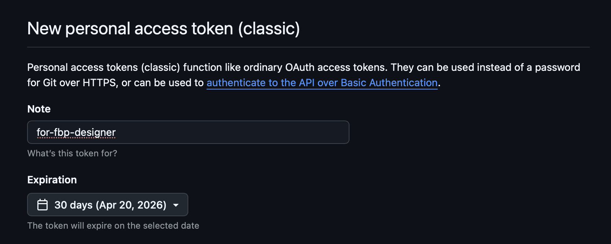
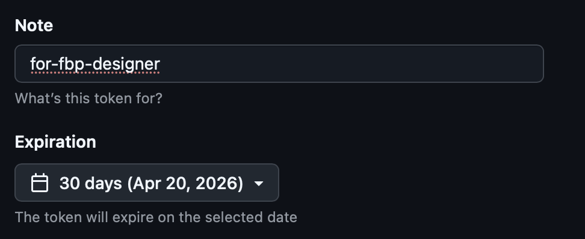
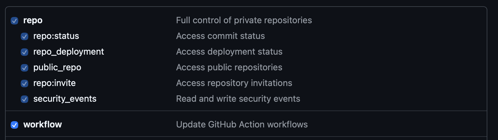
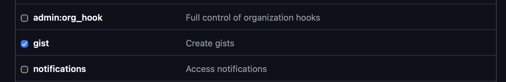
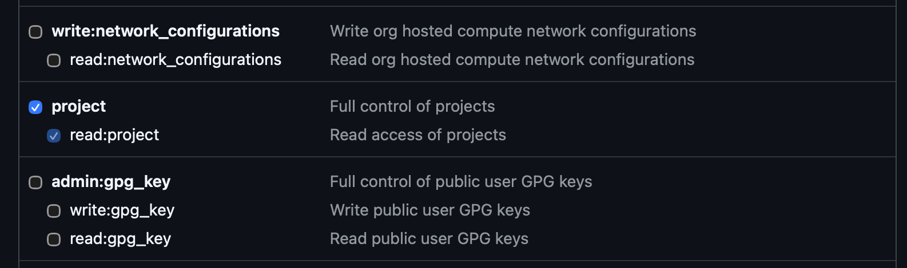
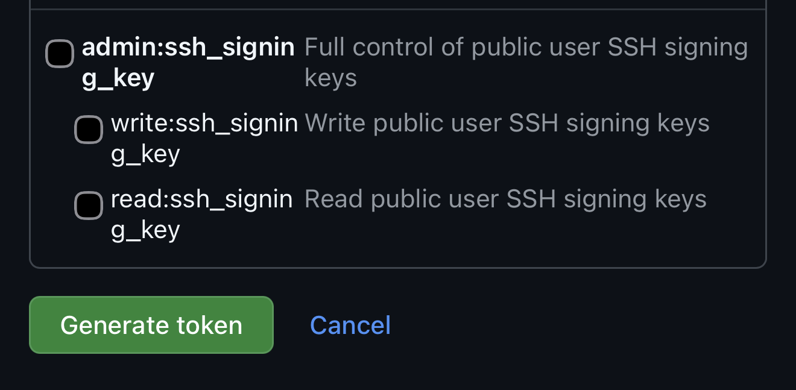
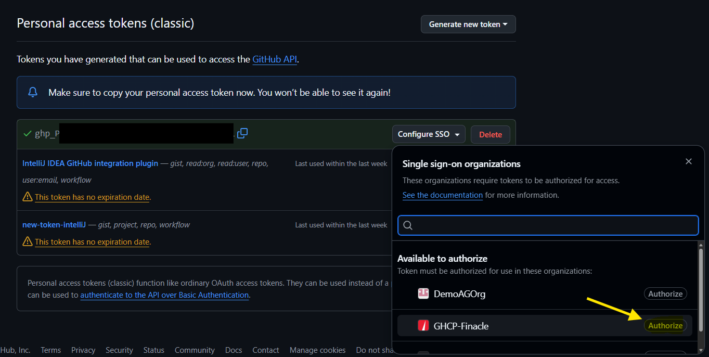
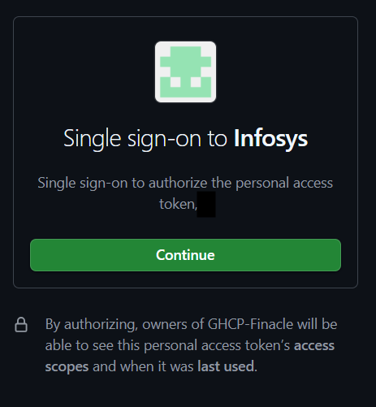
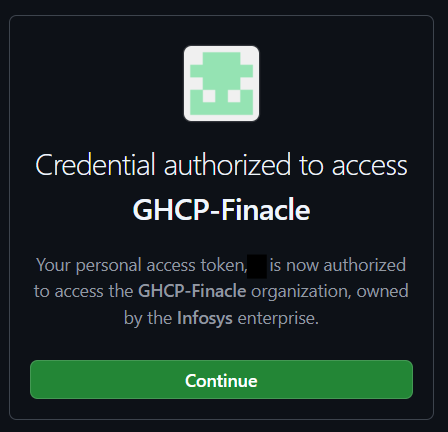
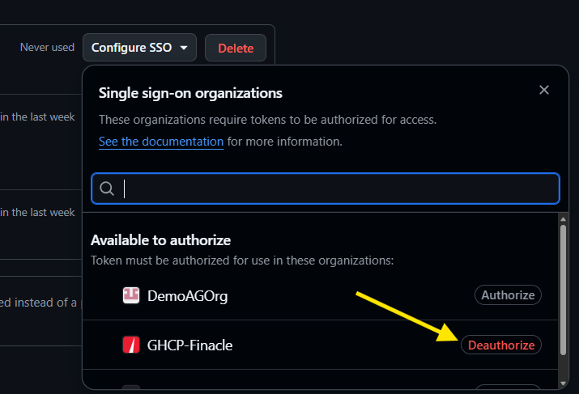

# Prerequisites

Before using Designer, ensure you have the following:

## 1. GitHub ID

You will log in to Designer using your existing GitHub credentials. No separate account is needed.

## 2. GitHub Token (with GHCP-Finacle access & authorisation)

Designer needs a personal GitHub token that has access to **GHCP-Finacle Org**. This is required because:

- Designer clones repositories and creates pull requests **under your identity** rather than a centralised service account
- All code changes are attributed to you in the Git history

### How to obtain a token

If you don't already have a token with the required access, follow these steps:

#### 2.1 Create a new token

Navigate to https://github.com/settings/tokens/new

#### 2.2 Provide the following details

**2.2.1 Note & Expiration Date**

**2.2.2 Scopes — workflow, gist, project**

**2.2.3 Generate token**

Note down the token provided on the screen.

#### 2.3 Provide org authorisation

Follow the steps in the workflow below

## 3. Repository and Jira details

When you start working, Designer will ask you for:

- The **repository name** you are working on
- The **Jira ticket number** for your feature

Have these ready before you begin. See [Setting Context](../workspaces/setting-context.md) for details.

## Next step

Once you have these, proceed to [Login And Setup](login-and-setup.md).
