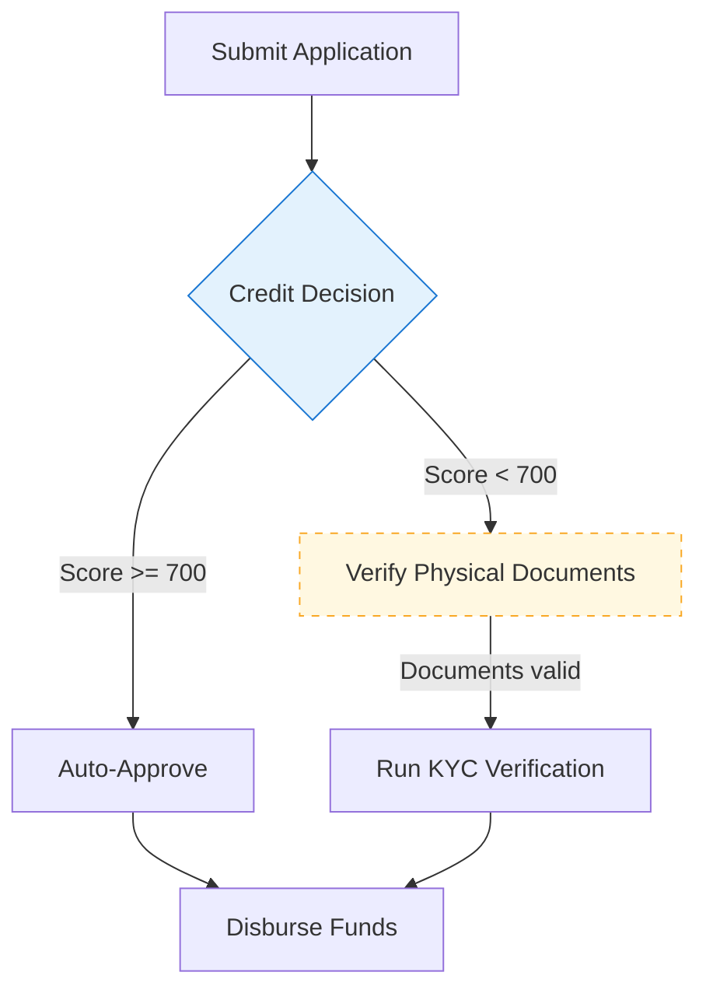

# Loan Origination

> End-to-end flow from application intake to disbursal.

| | |
|---|---|
| **Domain** | business |
| **Category** | Lending |
| **Actors** | Applicant, Underwriter, Loan Platform |
| **API links** | 3 |

## Flow

*Click any node to open its details in the side panel.*

## Steps

<section class="process-step" id="step-submit-application" markdown="1">

### Submit Application

`system` · **Actor:** Applicant

- **Trigger:** Applicant completes the online form
- **Outcome:** Application record created

The applicant submits personal and financial details through the online portal. The platform validates the payload and persists an application record with a generated identifier.

**Inputs:** Applicant personal details, Income documents
**Outputs:** Application ID

| API | Purpose |
|-----|---------|
| [Create Application](https://kg.example.com/api/api.loans.applications.create) | Persists the application and returns an Application ID |

**Next:** [Credit Decision](#credit-decision)

</section>

---

<section class="process-step" id="step-credit-gate" markdown="1">

### Credit Decision

`decision`

Routes the application based on the automated credit score.

**Branches:**

- **Score >= 700** → [Auto-Approve](#auto-approve)
- **Score < 700** → [Verify Physical Documents](#verify-physical-documents)

</section>

---

<section class="process-step" id="step-auto-approve" markdown="1">

### Auto-Approve

`system` · **Actor:** Loan Platform

- **Trigger:** Credit score clears the auto-approval threshold
- **Outcome:** Application marked approved

High-confidence applications are approved automatically.

| API | Purpose |
|-----|---------|
| [Approve Application](https://kg.example.com/api/api.loans.applications.approve) | Transitions the application to the approved state |

**Next:** [Disburse Funds](#disburse-funds)

</section>

---

<section class="process-step" id="step-verify-documents" markdown="1">

### Verify Physical Documents

`manual` &nbsp; 🟡 **Manual / out-of-system** · **Actor:** Underwriter

- **Trigger:** Application flagged for manual review
- **Outcome:** Documents verified or rejected

An underwriter inspects the submitted physical documents and confirms they match the application. This is an offline step with no system API.

**Next:** [Run KYC Verification](#run-kyc-verification) *(when: Documents valid)*

</section>

---

<section class="process-step" id="step-kyc-check" markdown="1">

### Run KYC Verification

`system` · **Actor:** Underwriter

Hands off to the standalone KYC verification process.

▶ **Triggers:** [KYC Verification](../business/kyc-verification.md)

**Next:** [Disburse Funds](#disburse-funds)

</section>

---

<section class="process-step" id="step-disburse" markdown="1">

### Disburse Funds

`system` · **Actor:** Loan Platform

- **Trigger:** Application approved and KYC cleared
- **Outcome:** Funds transferred to the applicant

The platform initiates the disbursal to the applicant's account.

**Inputs:** Approved Application ID, Disbursal account
**Outputs:** Disbursal reference

| API | Purpose |
|-----|---------|
| [Create Disbursal](https://kg.example.com/api/api.loans.disbursals.create) | Initiates the fund transfer |

*Terminal step.*

</section>

<!-- Slide-in detail drawer (populated by docs/javascripts/process-flow.js) -->

  <button class="panel-close" aria-label="Close">&times;</button>
  

