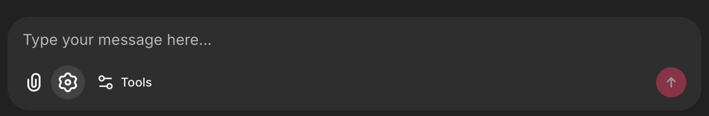
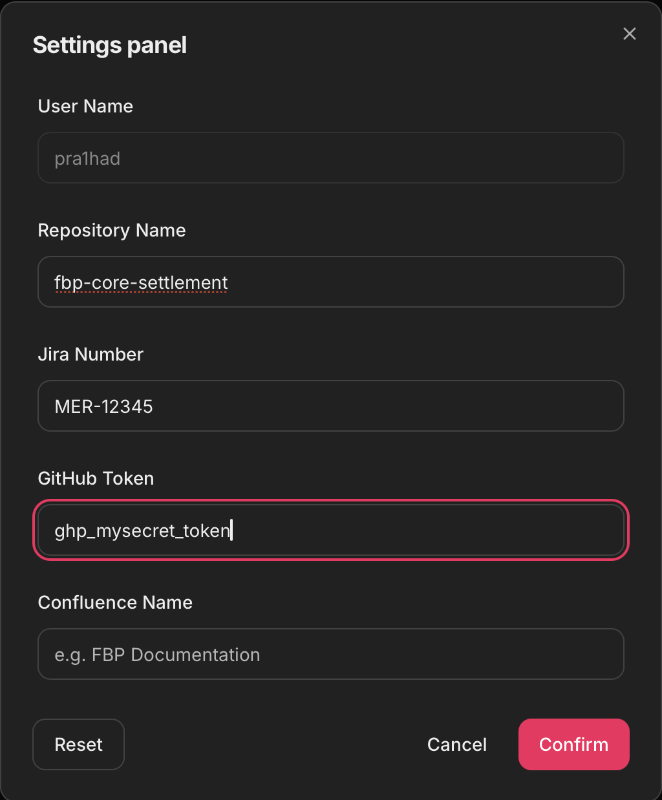

# Viewing & Editing Context

Designer provides utility tools to view your current context and update it if needed.

## Viewing context

You can check the currently active context at any time using the **[Viewing Editing Context#Context Tool](viewing-editing-context.md#context-tool)** tool. This shows:
- The repository you are working on
- The Jira ticket number
- Your workspace status

## Editing context

If you need to work on a different Jira ticket or switch repositories, use the [Viewing Editing Context#Context Tool](viewing-editing-context.md#context-tool)** tool. This will:

1. Allow you to update the repository and/or Jira number
2. Create a new [workspace](../core-concepts/what-is-a-workspace.md) for the updated context

> **Note:** Changing context creates a new workspace. Your previous workspace and its changes remain intact on its feature branch.

## Context Tool

### Accessing the tool

Click the `settings` icon at the bottom on the `message` box

### Settings panel

This panel pops up, allowing you to set the [Setting Context#Required Details](setting-context.md#required-details)

## Related

- [Setting Context](setting-context.md) — Initial context setup
- [Creating A Workspace](creating-a-workspace.md) — How workspaces are created
